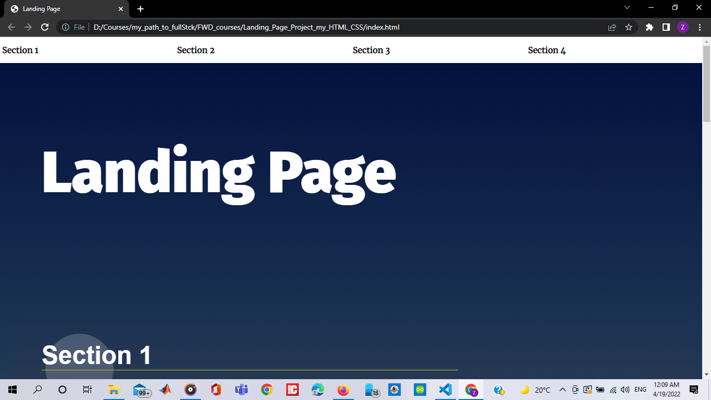

# Hi there this is my landing padge project from udacity's nano degree i hope that i did all the requirements correctly and thank you :)
This project requires you to build a multi-section landing page, with a dynamically updating navigational menu based on the amount of content that is added to the page.
 

## Table of Contents
* Html and css mostly from udacity's startup project but i did some changes and used flexbox hope you like my edit
* use Dom to generate a navbar 
* smooth scroll with css (using "html {scroll-behavior: smooth;}") and js using ("sectionscrollIntoView({behavior:"smooth",});)
* creating active class when scrolling through the sections 
 
# Project Files
You can obtain the project code here. To complete the project will mostly require modifying the js/app.js file, as well as modifications to the index.html and css/styles.css files to further update and customize your project.

[css file](Landing_Page_Project_Udacity/css/)
[js file](Landing_Page_Project_Udacity/js/)
